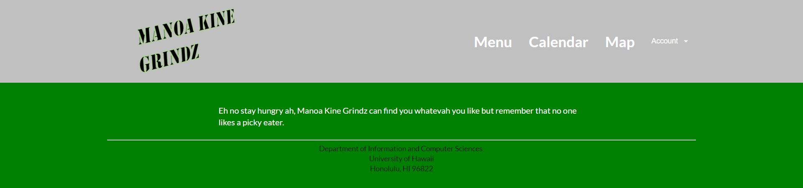
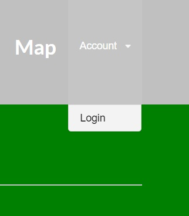
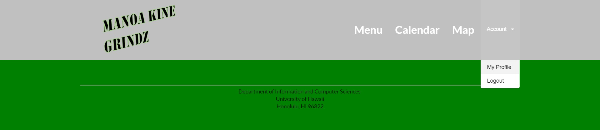
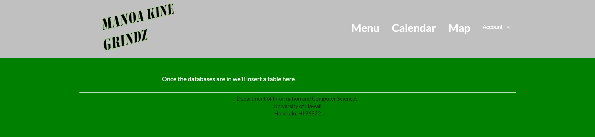
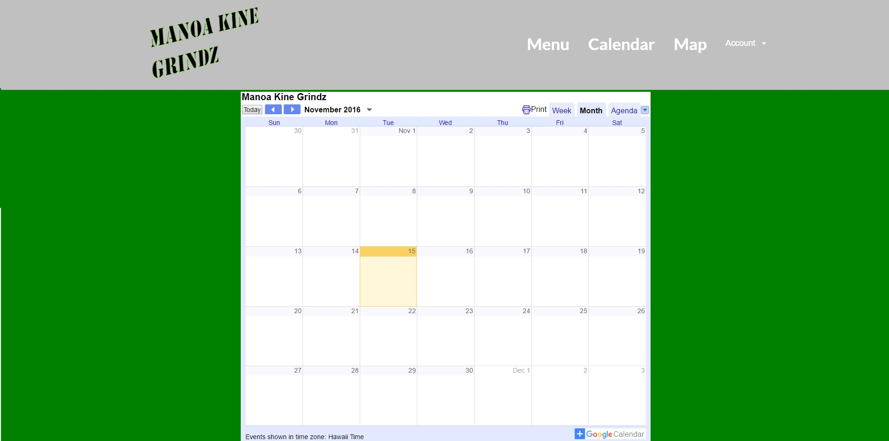
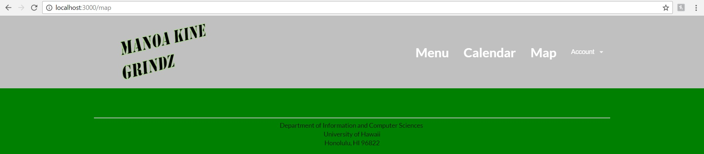

## Introduction
Manoa Kine Grindz is a reactive web-app that allows UH students to be able to quickly find what food is currently being served on campus.
## Installation
Clone the system over at https://github.com/manoa-kine-grindz/manoa-kine-grindz and run it on your computer using

```
meteor --settings ..config/settings.development.json
```

## Usage
The landing page should look as such:



Click on the top right word, "Account," to log in. The system uses UH-CAS for authentication so all students and faculty within the UH system should be able to log-in without having to create an account.


<br>
<sub>Logging in.</sub>

Once logged in, users can view and edit their profile. However, it is currently in the process of being debugged and as such it does not work right now.


<br>
<sub>The blank page.</sub>

Also, because the databases have not yet been implemented, the Menu page is also fairly empty and the home page after logging in is still blank.


<br>
<sub>Home page after logging in.</sub>
<br>

<br>
<sub>Menu page.</sub>

There is a calendar page that will be maintained by admins and will allow people to see what type of food will be served today and in the coming future. As implementing the specials is not a high priority item right now, the calendar is also blank.



Lastly, the Map page will show users where what food trucks are where. It will implement markers placed by the admins, but as admin privileges have not yet been implemented, it does not work. Also, the meteor package we used is outdated and does not work with the most recent build of meteor so we are currently finding a replacement.


<br>
<sub>The URL bar was included to show that there is a page for the map.</sub>

## Development
#strugglez

## Contact Us
If you have any questions, shoot us an email at mahoe7@hawaii.edu
