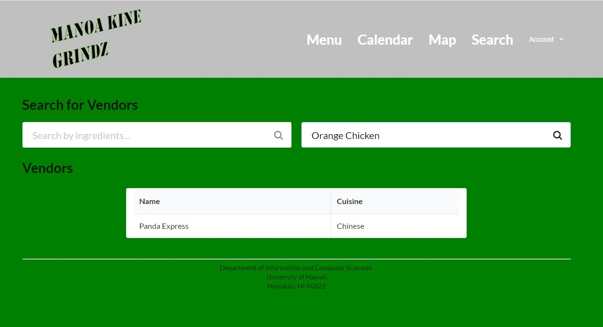
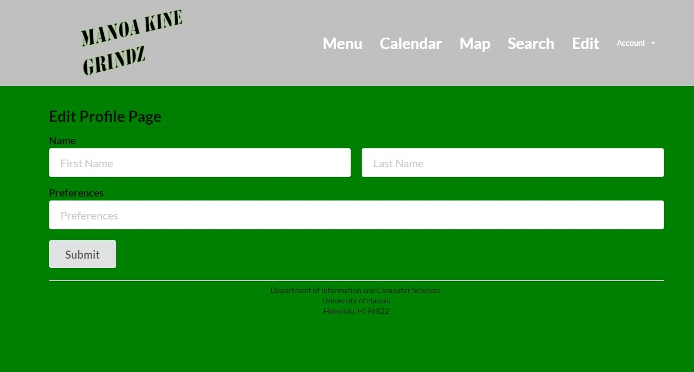

## Introduction
Manoa Kine Grindz is a web-app that allows UH students to be able to quickly find what food is currently being served on campus.<br>

<a href="https://manoa-kine-grindz.github.io/">Visit website here.</a>

## Guided Tour
*Please note that this website is still under construction.*

The landing page should look as such:


Click on the top right word, "Account," to log in. The system uses UH-CAS for authentication so all students and faculty within the UH system should be able to log-in without having to create an account.


<br>
<sub style="text-align:center;">Logging in.</sub>

Once logged in, users can view and edit their profile. However, it is currently in the process of being debugged and as such it does not work right now.


<br>
<sub style="text-align:center;">The blank page.</sub>

Also, because the databases have not yet been implemented, the Menu page is also fairly empty and the home page after logging in is still blank.


<br>
<sub style="text-align:center;">Home page after logging in.</sub>
<br>

<br>
<sub style="text-align:center;">Menu page.</sub>

There is a calendar page that will be maintained by admins and will allow people to see what type of food will be served today and in the coming future. As implementing the specials is not a high priority item right now, the calendar is also blank.


This is a search for page that will allow the user to filter through all of the available restaurants and fast food places on campus according to ingredients and foods. This is currently a mockup.



This is an edit profile page that will allow the user to essentially modify their food preferences regarding ingredients, cuisines, or restaurants.




## GitHub
Milestone 1: https://github.com/manoa-kine-grindz/manoa-kine-grindz/projects/1<br>
Milestone 2: https://github.com/manoa-kine-grindz/manoa-kine-grindz/projects/2<br>
Milestone 3: https://github.com/manoa-kine-grindz/manoa-kine-grindz/projects/3

## Developer Installation
Clone the system over at https://github.com/manoa-kine-grindz/manoa-kine-grindz and run it on your computer using

```
meteor --settings ..config/settings.development.json
```

## Development
The team went through a lot of unfortunate snags, and could not decide on a direction to take with the website. However, hopefully we have created something that looks like it could be useful.

## Contact Us
Please check out our portfolios at these links:

<a href="https://mahoe7.github.io">Michael Hoe</a><br>
<a href="https://kpk3.github.io">Keenan Kinimaka</a><br>
<a href="https://cmakalen.github.io">Chad Makalena</a><br>
